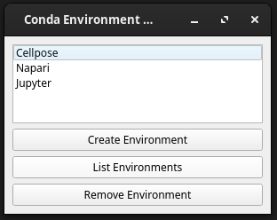

# iconda
Lightweight GUI to manage a curated selection of conda/mamba environments, and create clickable GUI icons for them.

## Why iconda?
If you've ever wanted to share a conda-based tool with someone else, but want your users to avoid messing with the terminal and virtual environments, iconda is for you.

iconda manages conda environments and generates desktop icons to start your favorite programs.

Goals:
- Cellpose
- Napari
- Jupyter Lab
